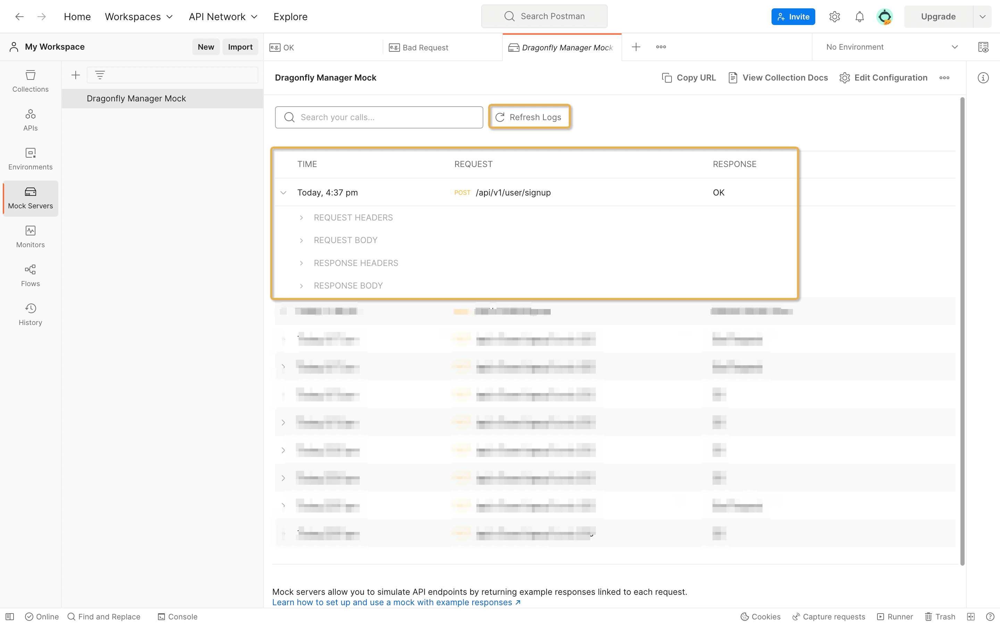

 # Contributing to Dragonfly Console 

It is warmly welcomed if you have the interest to hack on Dragonfly Console.
First, we encourage this kind of willingness very much.
And here is a list of contributing guide for you.

## Topics

- [Contributing to Dragonfly Console](#contributing-to-dragonfly-console)
  - [Topics](#topics)
  - [Reporting security issues](#reporting-security-issues)
  - [Reporting general issues](#reporting-general-issues)
  - [Code and doc contribution](#code-and-doc-contribution)
    - [Workspace Preparation](#workspace-preparation)
    - [Branch Definition](#branch-definition)
    - [Commit Rules](#commit-rules)
      - [Commit Message](#commit-message)
      - [Commit Content](#commit-content)
    - [PR Description](#pr-description)
  - [Postman mock server overview](#postman-mock-server-overview)
    - [What is a Postman?](#what-is-a-postman)
    - [Postman mock server steps](#postman-mock-server-steps)
      - [Download Postman](#download-postman)
      - [Import API](#import-api)
      - [Set up mock server](#set-up-mock-server)
      - [Add expample](#add-expample)

## Reporting security issues

Security issues are always treated seriously.
As our usual principle, we discourage anyone to spread security issues.
If you find a security issue of Dragonfly Console, please do not discuss it in
public and even do not open a public issue.
Instead, we encourage you to send us a private email to
[dragonfly-developers@googlegroups.com](mailto:dragonfly-developers@googlegroups.com) to report this.

## Reporting general issues

To be honest, we regard every user of Dragonfly Console as a very kind contributor.
After experiencing Dragonfly Console, you may have some feedback for the project.
Then feel free to open an issue via
[NEW ISSUE](https://github.com/dragonflyoss/console/issues/new).

Since we collaborate project Dragonfly Console in a distributed way,
we appreciate **WELL-WRITTEN**, **DETAILED**, **EXPLICIT** issue reports.
To make the communication more efficient, we wish everyone could
search if your issue is an existing one in the searching list.
If you find it existing, please add your details in comments
under the existing issue instead of opening a brand new one.

To make the issue details as standard as possible,
we setup an [ISSUE TEMPLATE](./.github/ISSUE_TEMPLATE) for issue reporters.
You can find three kinds of issue templates there: question,
bug report and feature request. Please **BE SURE** to follow
the instructions to fill fields in template.

There are a lot of cases when you could open an issue:

- bug report
- feature request
- performance issues
- feature proposal
- feature design
- help wanted
- doc incomplete
- test improvement
- any questions on project
- and so on

Also, we must remind that when filing a new issue,
please remember to remove the sensitive data from your post.
Sensitive data could be password, secret key,
network locations, private business data and so on.

## Code and doc contribution

Every action to make project Dragonfly Console better is encouraged.
On GitHub, every improvement for Dragonfly Console could be
via a PR (short for pull request).

- If you find a typo, try to fix it!
- If you find a bug, try to fix it!
- If you find some redundant codes, try to remove them!
- If you find some test cases missing, try to add them!
- If you could enhance a feature, please **DO NOT** hesitate!
- If you find code implicit, try to add comments to make it clear!
- If you find code ugly, try to refactor that!
- If you can help to improve documents, it could not be better!
- If you find document incorrect, just do it and fix that!
- ...

Actually, it is impossible to list them completely.
Just remember one principle:

> WE ARE LOOKING FORWARD TO ANY PR FROM YOU.

Since you are ready to improve Dragonfly Console with a PR,
we suggest you could take a look at the PR rules here.

- [Workspace Preparation](#workspace-preparation)
- [Branch Definition](#branch-definition)
- [Commit Rules](#commit-rules)
- [PR Description](#pr-description)

### Workspace Preparation

To put forward a PR, we assume you have registered
a GitHub ID. Then you could finish
the preparation in the following steps:

1. **FORK** Dragonfly Console to your repository.

  To make this work, you just need to click the button Fork
  in right-left of [dragonflyoss/console](https://github.com/dragonflyoss/console)
  main page. Then you will end up with your repository in
  `https://github.com/<your-username>/Console`,
  in which `your-username` is your GitHub username.

1. **CLONE** your own repository to develop locally.

  Use `git clone https://github.com/dragonflyoss/console.git`
  to clone repository to your local machine.
  Then you can create new branches to finish the change you wish to make.

1. **Set Remote** upstream to be
    `https://github.com/dragonflyoss/console.git`

  using the following two commands:

  ```bash
  git remote add upstream https://github.com/dragonflyoss/console.git
  git remote set-url --push upstream no-pushing
  ```

  With this remote setting, you can check your git remote configuration like this:
https://github.com/dragonflyoss/console.git
  ```bash
  $ git remote -v
  origin     https://github.com/<your-username>/console.git (fetch)
  origin     https://github.com/<your-username>/console.git (push)
  upstream   https://github.com/dragonflyoss/console.git (fetch)
  upstream   no-pushing (push)
  ```

  Adding this, we can easily synchronize local branches with upstream branches.

1. **Create a branch** to add a new feature or fix issues

  Update local working directory:

  ```bash
  cd  console
  git fetch upstream
  git checkout main
  git rebase upstream/main
  ```

  Create a new branch:

  ```bash
  git checkout -b <new-branch>
  ```

  Make any change on the `new-branch` then build and test your codes.

### Branch Definition

Right now we assume every contribution via pull
request is for [branch main](https://github.com/dragonflyoss/console)
in Dragonfly Console. Before contributing,
be aware of branch definition would help a lot.

As a contributor, keep in mind again that every
contribution via pull request is for branch main.
While in project Dragonfly Console, there are several other branches,
we generally call them rc branches, release branches and backport branches.

Before officially releasing a version,
we will checkout a rc(release candidate) branch.
In this branch, we will test more than branch main.

When officially releasing a version,
there will be a release branch before tagging.
After tagging, we will delete the release branch.

When backporting some fixes to existing released version,
we will checkout backport branches. After backporting,
the backporting effects will be in PATCH number in
MAJOR.MINOR.PATCH of [SemVer](http://semver.org/).

### Commit Rules

Actually in Dragonfly Console, we take two rules seriously when committing:

- [Commit Message](#commit-message)
- [Commit Content](#commit-content)

#### Commit Message

Commit message could help reviewers better understand
what the purpose of submitted PR is.
It could help accelerate the code review procedure as well.
We encourage contributors to use **EXPLICIT** commit
message rather than an ambiguous message. In general,
we advocate the following commit message type:

- feat: xxxx.For example, "feat: make result show in sorted order".
- fix: xxxx. For example, "fix: fix panic when input nil parameter".
- docs: xxxx. For example, "docs: add docs about storage installation".
- style: xxxx. For example, "style: format the code style of Constants.java".
- refactor: xxxx. For example, "refactor: simplify to make codes more readable".
- test: xxx. For example, "test: add unit test case for func InsertIntoArray".
- chore: xxx. For example, "chore: integrate travis-ci".
  It's the type of maintenance change.

On the other side, we discourage contributors
from committing messages in the following ways:

- ~~fix bug~~
- ~~update~~
- ~~add doc~~

#### Commit Content

Commit content represents all content changes
included in one commit. We had better include things
in one single commit which could support reviewer's complete
review without any other commits' help. In another word,
contents in one single commit can pass the CI to avoid code mess.
In brief, there are two minor rules for us to keep in mind:

- avoid very large change in a commit.
- complete and reviewable for each commit.

No matter what the commit message, or commit content is,
we do take more emphasis on code review.

### PR Description

PR is the only way to make change to Dragonfly Console project files.
To help reviewers better get your purpose,
PR description could not be too detailed.
We encourage contributors to follow the
[PR template](./.github/PULL_REQUEST_TEMPLATE.md) to finish the pull request.


##  Postman mock server overview

In this article, we will see how to import Swagger API into Postman and use mock server.

###  What is a Postman?

Postman is an API platform for building and using APIs. Postman simplifies each step of the API lifecycle and streamlines collaboration so you can create better APIs—faster.

###  Postman mock server steps

####  Download Postman

Download the [app](https://www.postman.com/downloads) to get started with the Postman API platform.

#### Import API

If you need to use a mock server, please import the [swagger.yaml](https://raw.githubusercontent.com/dragonflyoss/Dragonfly2/main/api/manager/swagger.yaml) file of Dragonfly Manager, refer to [importing-and-exporting-data](https://learning.postman.com/docs/getting-started/importing-and-exporting-data/).
 
**Step 1:** Import API.


**Step 2:** Copy the swagger.yaml URL.
  

 
**Step 3:** Select OpenAPI 2.0 with Postman collection.


    
#### Set up mock server
 
To use mock server, please do the following, refer to  [mocking-data-setting-up-mock](https://learning.postman.com/docs/designing-and-developing-your-api/mocking-data/setting-up-mock/).

**Step 1:** Choose **Collections** in the sidebar, choose the more actions icon next to the collection you want to mock, then choose **Mock collection**.


    
**Step 2:** Supplement mock servers name information, and **Create Mock Server**.


**Step 3:** Copy the mock server URL.


    
**Step 4:** Replace the mock server URL, click **send** to send the request, if you need to copy the URL, remember to copy the baseUrl.
   
 

 **Step 5:** To verify whether the request is successful, please open **Mock Servers** to view all request responses.



**Step 6:** Environment variable export URL ,refer to [environment-variables](https://nextjs.org/docs/basic-features/environment-variables).


**Step 7:** successful demo.


**Step 8:** Not Found demo.


#### Add expample

**Step 1:** If you want more examples or return different data, you can add an example.


    
**Step 2:** Modify the name such as Oauth Signin, modify the response message, and save the example.

 

